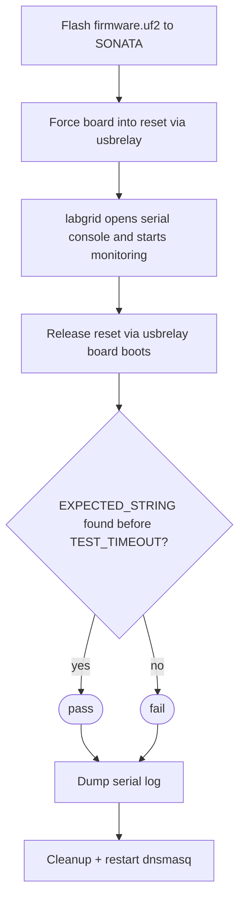

# Sonata Hardware-in-Loop Testing

This directory contains parts of the testing framework used to do HIL testing of the CHERIoT network-stack on sonata hardware.

The board is hosted in The Capable Hub's board farm and details on how it is connected can be found in their [board farm documentation](https://www.thecapablehub.org/docs/hardware/#newae-sonata-one).

The CI workflow handles flashing each of the network-stack example projects onto the board, resets and then monitors the UART for an expected string to indicate success.
Most of this automation is handled by:

- [pytest](https://docs.pytest.org/en/stable/) - Overall running of each test
- [Labgrid](https://labgrid.readthedocs.io/en/latest/) - Mainly for monitoring serial and test timeouts
- usbrelay - Custom software for controlling the state of the RESET (SW5) button

### Files

| File | Description |
|------|-------------|
| `run-hil-tests.sh` | Loops through each example, copies the firmware onto the sonata, invokes pytest, dumps the serial log, and cleans up. Tracks pass/fail per test and exits non-zero if any test fails. |
| `test_generic.py` | The actual pytest test. Releases the board reset via usbrelay, then uses labgrid's `console.expect()` to wait for `EXPECTED_STRING` within `TEST_TIMEOUT` seconds. |
| `conftest.py` | pytest session config. Activates Labgrid's serial console component so it can begin monitoring before the Reset is released. |
| `local.yaml` | Labgrid environment file. Describes the hardware target ie serial port `/dev/ttyUSB2` at 921600 baud. |

### Test Flow

The general flow for each test is to setup the hardware and monitor the serial console for some known / expected string (`EXPECTED_STRING`) within the given timeout (`TEST_TIMEOUT`).

