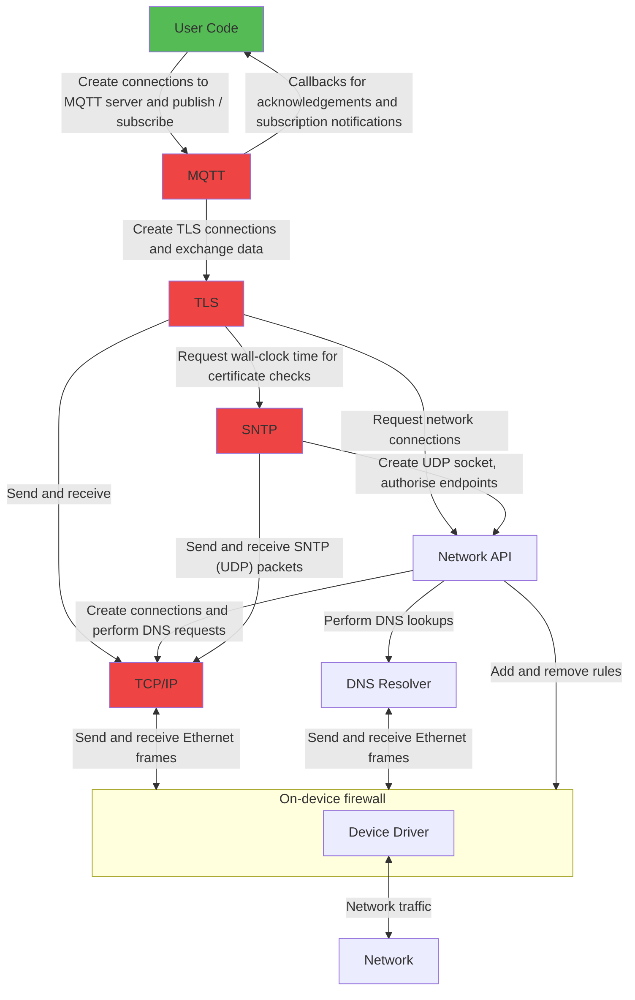

CHERIoT Experimental Network Stack
==================================

This repository contains the code for the experimental CHERIoT network stack.
This is an early work-in-progress implementation that has been made public to facilitate easier collaboration.

WARNING: This is not fully hardened against our desired threat model.
It should not be used in production.
Note especially that there is no strong entropy source on the Arty A7 FPGA prototyping platform and so any TLS connection is moderately easy to compromise.
It is expected to approach production quality in 2024H2.

Third-party code reuse
----------------------

The network stack includes components from a variety of third parties:

 - [FreeRTOS-Plus-TCP](https://github.com/FreeRTOS/FreeRTOS-Plus-TCP) provides the TCP/IP implementation.
 - [FreeRTOS coreSNTP](https://github.com/FreeRTOS/coreSNTP) provides the SNTP client.
 - [FreeRTOS coreMQTT](https://github.com/FreeRTOS/coreMQTT) provides the MQTT client.
 - [BearSSL](https://www.bearssl.org) provides the TLS 1.2 stack.

This demonstrates the CHERIoT platform's ability to adopt existing codebases.
We are building around 100 KLoC of third-party code into this stack.
This is mature and well-tested code that we have no desire to rewrite.
A side-channel-resistant TLS implementation, for example, would be a huge undertaking.

Our additions add security boundaries around these existing components and less-general APIs that are tailored for our expected use cases.
The new code in this repository is around 3% of the size of the large components that we are reusing *with no code changes*.

Compartmentalisation
--------------------

The initial implementation has seven compartments.
Four are mostly existing third-party code with thin wrappers:

 - The TCP/IP stack is in a compartment.
   The FreeRTOS code was originally written on the assumption of a single security domain and separating it would require refactoring that would be hard to keep up to date.
 - The SNTP compartment is mostly just another consumer of the network stack, but it provides a real-time clock that is used by the TLS stack.
 - The TLS stack is, again, mostly unmodified BearSSL code, with just some thin wrappers added around the edges.
 - The MQTT compartment, like the SNTP compartment, is just another consumer of the network stack (the TLS layer, specifically) and provides a simple interface for connecting to MQTT servers, publishing messages and receiving notifications of publish events.

These are joined by three new compartments:

 - The firewall compartment is the only thing that talks directly to the network device.
   It filters inbound and outbound frames.
 - The NetAPI compartment provides the control plane.
 - The DNS resolver compartment provides DNS lookup services, interfacing directly with the firewall.

The communication is (roughly) summarised below:



The TCP/IP stack is a large compartment with a lot of state.
It is fault-tolerant: when an error is triggered (CHERI spatial or temporal safety fault, assertion), the compartment is automatically reset to a pristine state and restarted.
We expand on this capability [below](#automatic-restart-of-the-tcpip-stack).

Unlike the TCP/IP stack, the TLS compartment is almost completely stateless.
This makes resetting the compartment trivial, and gives strong flow isolation properties: Even if an attacker compromises the TLS compartment by sending malicious data over one connection that triggers a bug in BearSSL (unlikely), it is extraordinarily difficult for them to interfere with any other TLS connection.

All inbound and outbound data go through the on-device firewall, which is controlled by the Network API compartment.
The TCP/IP stack has no access to the NetAPI control-plane interface.
Thus, a compromise that gets arbitrary-code execution in the network stack cannot open new firewall holes (to join a DDoS botnet such as [Mirai](https://en.wikipedia.org/wiki/Mirai_(malware)), for example).
The worst it can do to the rest of the system is provide malicious data, but a system using TLS will have HMACs on received messages and so this is no worse than a malicious packet being injected from the network.

The DNS resolver comes as a separate compartment to support this design: since the Network API compartment operates with domain names, and the firewall with IPs, the translation between the two must be done by a trusted entity.
For instance, if the application tells the Network API that the only endpoint it will ever communicate with is `example.com`, the Network API will need to translate that domain name into an IP to create a firewall entry.
If this translation was done by a potentially compromised TCP/IP stack, it could spoof the DNS translation and return whichever IP address it wants to connect to, to create a corresponding malicious firewall entry.
The isolated DNS resolver is trusted to perform this task independently of the TCP/IP stack.

This compartmentalised design comes on top of the spatial and temporal safety properties that the CHERIoT platform provides at a base level.

Capabilities authorise communication
------------------------------------

CHERI systems use capabilities to authorise memory accesses.
CHERIoT provides abstractions for software-defined capabilities that can authorise different operations.
These are represented in the hardware via sealed (CHERI) capabilities that refer to specific kinds of objects.
These sealed capabilities can be treated as opaque tokens (and cannot be directly used) by most code but can be unsealed by the compartment that owns the corresponding unsealing capability.

The network stack uses three kinds of sealed capabilities:

 - Connection capabilities are baked into the firmware image and authorise establishing a connection.
 - Socket capabilities are dynamically created and provide a tamper-proof opaque handle that authorises sending and receiving data over a socket.
 - TLS session capabilities are also dynamically created (and wrap socket capabilities) and authorise sending and receiving encrypted data over a TLS session.

The flow for establishing a network connection is as follows:

 1. User code presents a connection capability to the Network API compartment authorising a connection to a remote host.
 2. The Network API compartment opens inspects the capability and extracts the name of the host.
 3. The Network API opens the firewall hole for the DNS resolver.
 4. The Network API compartment instructs the TCP/IP compartment to look up the name.
 5. The TCP/IP compartment sends and receives UDP packets (forwarded via the Firewall compartment) to look up the name.
 6. The Network API compartment instructs the firewall to close the hole for the DNS lookup.
 7. The Network API compartment instructs the TCP/IP stack to create a (sealed) socket.
 8. The Network API compartment instructs the firewall to open a hole for the local port and the remote endpoint.
 9. The Network API compartment returns the sealed capability for the socket to the caller.

At the end of this, the original caller can directly call the send and receive functions in the TCP/IP stack to send and receive data.

Safe sharing
------------

Each compartment needs to share some data with the others.
For UDP, the receive path can be entirely zero copy (after the packet leaves the driver).
A UDP packet arrives and is copied from the network interface into a new allocation.
This is processed by the TCP/IP stack and then claimed with the allocator capability passed the receive-message call, freed with the network stack's allocator capability, and returned.
This ensures that the packet is freed once the caller frees it, transferring ownership out to the caller.
Callers worried about time-of-check-to-time-of-use attacks from a compromised TCP/IP compartment may need to defensively copy.

BearSSL maintains its own send and receive buffers.
The TCP/IP stack can copy directly to and from these, as long as we can make this secure.
These are passed from the TLS compartment to the TCP/IP compartment as *bounded* capabilities with only load or store permissions.
This means that the TCP/IP stack cannot access out of bounds and cannot capture the pointer.
In the case of a store (read from the network), the TCP/IP compartment also cannot read stale data from the buffer (for example, it cannot read previously decrypted data).

Auditing
--------

The network stack relies on some interfaces being restricted to certain compartments.
For example, there are some APIs in the TCP/IP and Firewall compartments that should be exposed only to the Network API compartment.
These can be checked by the [cheriot-audit](https://github.com/CHERIoT-Platform/cheriot-audit) tool, with the aid of the policy in this repository.

The `network_stack.rego` file also makes it easy to extract connection capabilities.
For example, if you run the following Rego query against the [HTTPS example](examples/03.HTTPS) (after loading `network_stack.rego` with `-m`):

```rego
data.network_stack.all_connection_capabilities
```

You should see the following output (piped through `jq` for pretty printing):

```json
[
  {
    "capability": {
      "connection_type": "UDP",
      "host": "pool.ntp.org",
      "port": 123
    },
    "owner": "SNTP"
  },
  {
    "capability": {
      "connection_type": "TCP",
      "host": "example.com",
      "port": 443
    },
    "owner": "https_example"
  }
]
```

This tells you that the SNTP compartment has a capability that allows it to create a UDP socket and communicate with pool.ntp.org and that the `https_example` compartment can make TCP connections to example.com:443.
No other compartments can make connections and no compartment may communicate with hosts not on this list.
This can feed into more auditing infrastructure.

Do you want to check that all TLS connections are encrypted?
Try asking which compartments are calling the TCP connection function:

```rego
data.compartment.compartments_calling_export_matching("NetAPI", `network_socket_connect_tcp(.*)`)
```

Hopefully the output is very short:

```json
["TLS"]
```

This means that all TCP connections are made via the TLS compartment and, unless the TLS compartment is compromised, no traffic can flow over TCP that is not encrypted.
Unfortunately, SNTP is unencrypted.
It can have verified signatures (which you absolutely should use in a real deployment: the current prototype just talks to pool.ntp.org without authentication) though.
This should be the only thing used with UDP:

```rego
data.compartment.compartments_calling_export_matching("NetAPI", `network_socket_udp(.*)`)
```

```json
["SNTP"]
```

Now that you know that the SNTP compartment is the only one that can send and receive UDP packets, it's worth checking that it really is talking to the host that you expect:

```rego
[ data.network_stack.decode_connection_capability(c) | c = input.compartments.SNTP.imports[_] ; data.network_stack.is_connection_capability(c) ]i
```

```json
[{"connection_type":"UDP", "host":"pool.ntp.org", "port":123}]
```

If you've modified the SNTP compartment to point to your NTP service and use its authentication credentials, then this should be different.
This can all be part of your firmware's auditing policy.

Automatic restart of the TCP/IP stack
-------------------------------------

We designed the TCP/IP stack to automatically and transparently restart on failure (e.g., a CHERI fault or an assertion).
The restart procedure broadly works like this (simplified for didactic reasons):

1. The error handler of the TCP/IP compartment is triggered and starts the reset procedure.
2. It first sets a flag to prevent any new thread from entering the compartment.
3. Then, it sets all synchronization primitives of the compartment (locks, futexes) for destruction. This wakes up sleeping threads present in the compartment, and prevents them from blocking again.
4. Then, it waits for all threads present in the compartment (apart from the FreeRTOS network thread) to exit, either through normal control-flow, or by crashing.
5. Finally, it frees all the memory of the compartment, resets all global state, and calls the start function of the network stack, which restarts the TCP/IP stack into a pristine working state.
6. After the reset, any further call to the socket API (apart from `network_socket_close`) with an old socket from the previous instance of the network stack will be detected and failed with an `-ENOTCONN` code. This pushes callers to close the sockets and create new ones with the new instance of the TCP/IP stack.

The implementation details of the reset slightly deviate from this description.
See the technical documentation in `tcpip_error_handler.h` for a full perspective.

Note that the current implementation of the automatic reset makes a few assumptions:

- The TCP/IP stack cannot currently recover from a crash due to a stack overflow in the TCP/IP compartment. This is due to a limitation of the implementation of the switcher, which cannot trigger the error handler on stack overflow. This limitation should be addressed soon.
- A small set of globals called 'reset-critical' outlive resets and/or are necessary for the reset. We assume that this data has not been corrupted. This data is correspondingly annotated in the source code.
- The control-flow of threads in the compartment has not been altered.

These assumptions leave some attack surface to malicious actors.
We are working on improvements to remove or weaken them.
